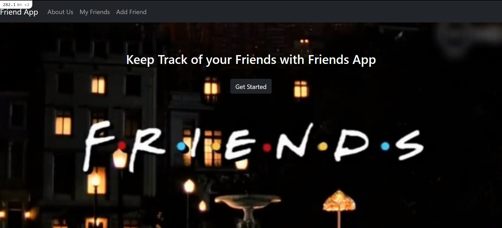
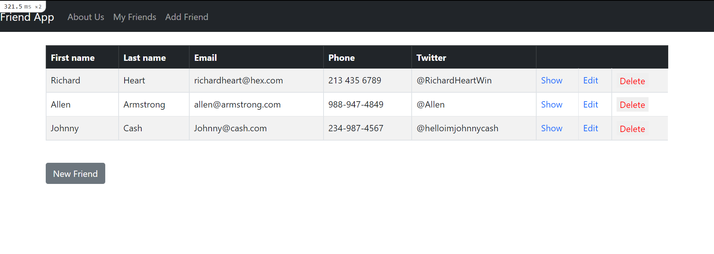

# React-Ruby-on-Rails Friends App

## Description
This application is designed to explore and illustrate the possibility of using Ruby on Rails and React front end framework together to create a fully functional basic CRUD application.

## Table of Contents
  - [Installation](#installation)
  - [Usage](#usage)
  - [Technologies](#technologies)
  - [License](#license)
  - [Next Steps](#next-steps)
  - [Questions](#questions)


## Installation
``` npm i ```

## Usage
Simply click on the deployed application link to start keeping track of your friends today!




## Technologies
* React 
* Ruby on Rails 
* Bootstrap 
* React-Bootstrap

## License


  [MIT](https://opensource.org/licenses/MIT)
  

  

## Next Steps
* Deployment
* Replace pages not created with React components with React Components

## Questions
For additional questions please contact:
* Jayme Mizelle
* Email: jlm_developer@protonmail.com
* https://github.com/jaymemizelle
