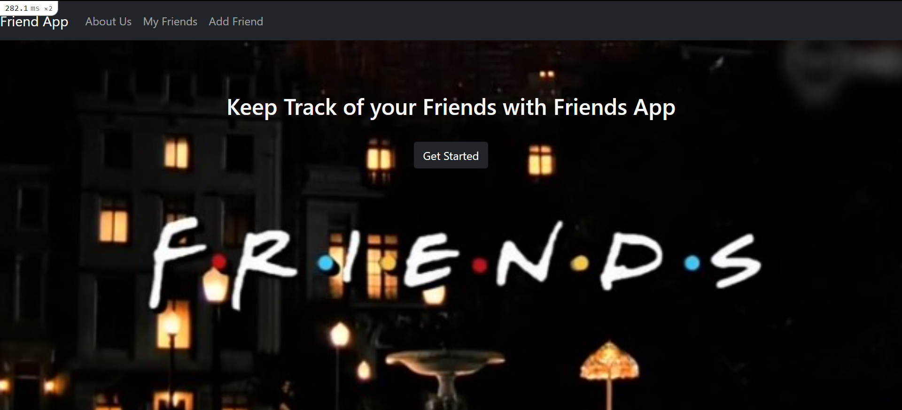
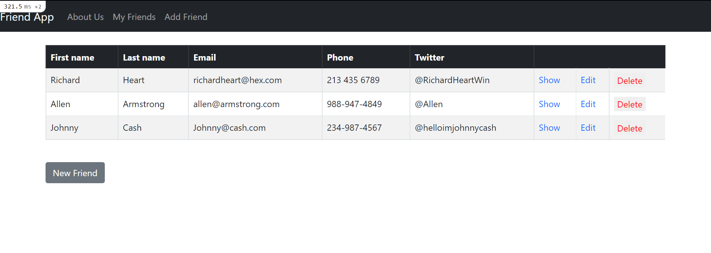

# React / Ruby on Rails Friends App

## Description

This application explores using Ruby on Rails and React together to build a fully functional, basic CRUD application.

## Table of Contents

- [Installation](#installation)
- [Usage](#usage)
- [Technologies](#technologies)
- [License](#license)
- [Next Steps](#next-steps)
- [Questions](#questions)

## Installation

```
bundle install
rails db:create db:migrate
```

## Usage

Start the Rails server:

```
rails server
```

Visit `http://localhost:3000`, create an account, and start keeping track of your friends.




## Technologies

- React
- Ruby on Rails
- Bootstrap
- React-Bootstrap
- SQLite3

## License

[MIT](https://opensource.org/licenses/MIT)


## Next Steps

- Deploy the application
- Replace remaining server-rendered pages with React components

## Questions

For additional questions please contact:

- Jayme Hall
- GitHub: [https://github.com/jaymehall](https://github.com/jaymehall)
- LinkedIn: [https://www.linkedin.com/in/jayme-hall/](https://www.linkedin.com/in/jayme-hall/)
