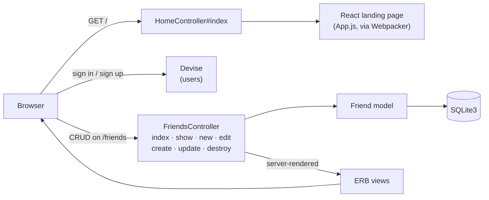

# React / Ruby on Rails Friends App

## Description

This application explores using Ruby on Rails and React together to build a fully functional, basic CRUD application.

## Table of Contents

- [How It Works](#how-it-works)
- [Installation](#installation)
- [Usage](#usage)
- [Technologies](#technologies)
- [License](#license)
- [Next Steps](#next-steps)
- [About the Creator](#about-the-creator)

## How It Works

The root path is a React landing page; everything else is standard Rails MVC, with [Devise](https://github.com/heartcombo/devise) gating access to the CRUD routes:


```mermaid
flowchart LR
    B["Browser"] -->|"GET /"| HOME["HomeController#index"]
    HOME --> REACT["React landing page\n(App.js, via Webpacker)"]

    B -->|"sign in / sign up"| DEVISE["Devise\n(users)"]

    B -->|"CRUD on /friends"| FC["FriendsController\nindex · show · new · edit\ncreate · update · destroy"]
    FC --> MODEL["Friend model"]
    MODEL --> DB[("SQLite3")]
    FC -->|"server-rendered"| VIEWS["ERB views"]
    VIEWS --> B
```

`FriendsController` follows the standard Rails scaffold pattern. Strong parameters gate what a request can actually set on a `Friend`:

```ruby
# Only allow a list of trusted parameters through.
def friend_params
  params.require(:friend).permit(:first_name, :last_name, :email, :phone, :twitter)
end
```

## Installation

```
bundle install
rails db:create db:migrate
```

## Usage

Start the Rails server:

```
rails server
```

Visit `http://localhost:3000`, create an account, and start keeping track of your friends.


## Technologies

- React
- Ruby on Rails
- Bootstrap
- React-Bootstrap
- SQLite3

## License

[MIT](https://opensource.org/licenses/MIT)


## Next Steps

- Deploy the application
- Replace remaining server-rendered pages with React components

## About the Creator

Built to explore what Ruby on Rails and React look like working together on a single app.

- LinkedIn: https://www.linkedin.com/in/jayme-hall/
- GitHub: https://github.com/jaymehall/
- Website: [https://jaymehall-dev.netlify.app/](https://jaymehall-dev.netlify.app/)
